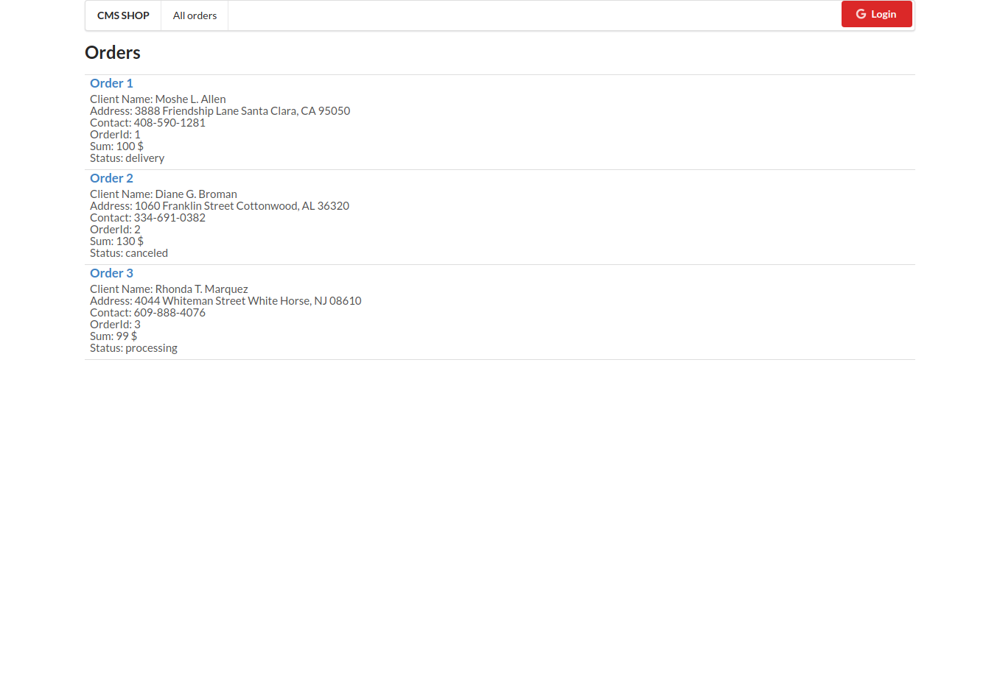
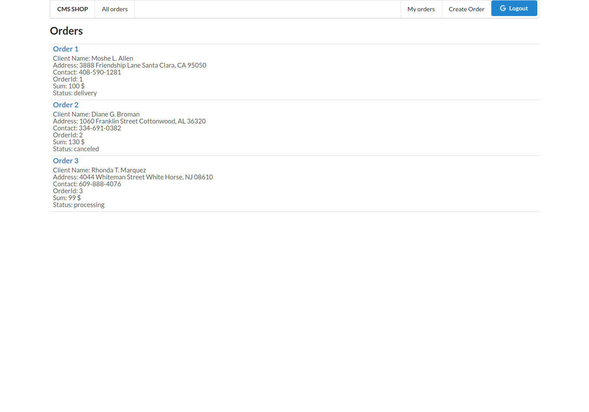
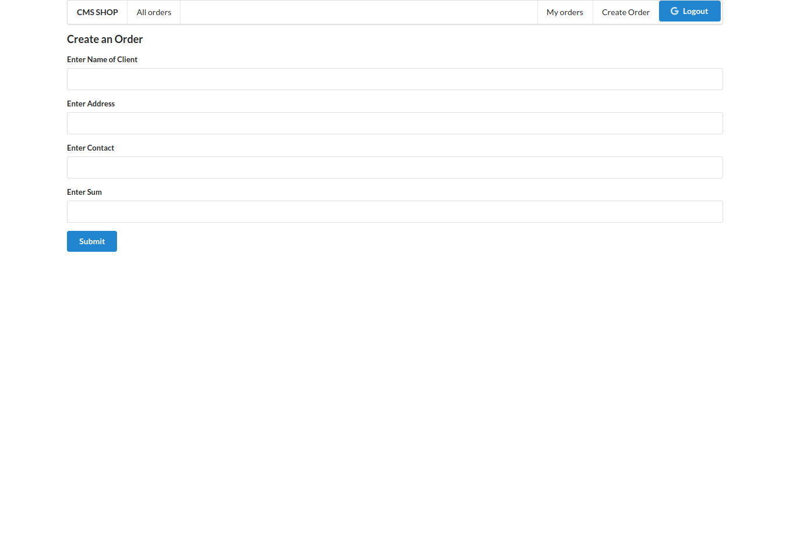
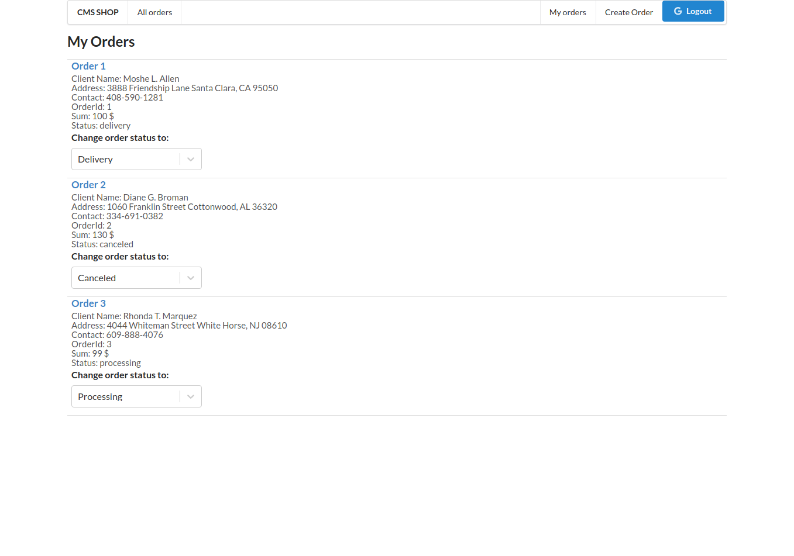

# CMS System for online shop

## Project Structure

### Backend

    /flask-server

    Web Server based on Pythons web framework Flask
    Handeles HTTP Requests on creating, getting, changing and deleting of Orders
    As Databases uses SQLAlchemy toolkit

### Frontend

    /shop-cms

    Web Application based on React.js, Redux.js

    Feattures:
    - All users can see the list of all orders

    - User can login using Googles OAuth 2.0
    - Logged in users have buttons in menu: 'My orders', 'Create Order'

    - Logged in user can create an order on path /create-order

    - Logged in user can see the list of created orders by him on path /my-orders
    - User can edit the status of his orders

